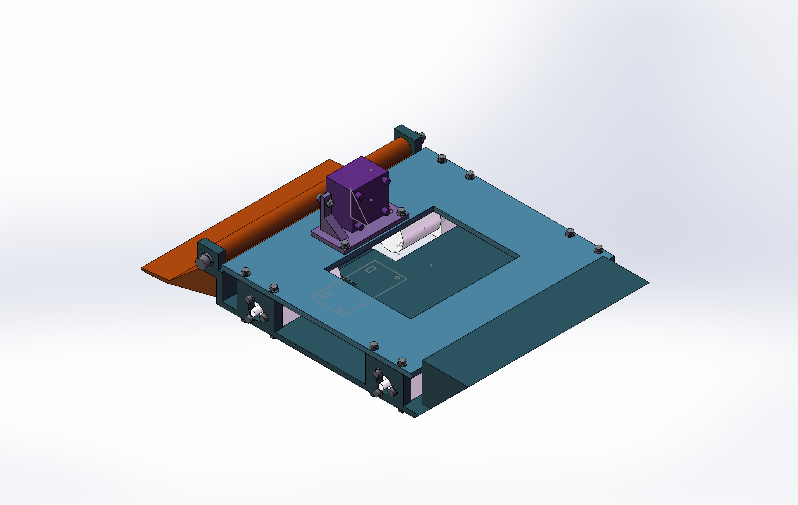

# 轮式自主格斗机器人：结构设计工作记录

这是一个参赛机器人的**在研结构展示**。仓库收录当前工作模型中的自制打印结构件、装配预览和验证状态。它不是可直接生产的完整整车，也没有经过实车比赛验证。

## 设计内容

- 双层底盘、下沉电机安装位与一体电机座。
- 手动翻转的整块塑料前铲及实体承力止挡。
- 底盘一体尾坡、摄像头一体安装座、电池压梁与传感器夹持座。
- 非黑色塑料打印结构方案；紧固件仅作连接使用。

`cad-parts/` 提供这些零件的原生 SolidWorks `.SLDPRT` 文件。`previews/` 是工作装配的截图。完整装配涉及统一部件模型和仍在核对的接口，本仓库暂未提供可宣称装配完成的 `.SLDASM`。

## 当前状态（2026-09-17）

工作装配已纳入四轮、控制系统和部分传感器，但仍缺四只边缘光电；轮组与联轴器转动时存在待修正的微量干涉，后向红外光轴也需调整。轮胎外径、轮毂锁紧、传感器实物尺寸和整车质量等仍需实测。详细记录见 [续接核查](docs/续接核查与待确认.md)和[逐只传感器核查](docs/逐只传感器核查.md)。

**不要根据此仓库直接打印或参赛。** CAD 干涉检查和渲染图不能证明能上台、能检测边缘或符合全部比赛规则。

本方案研究过第三方设计报告中的双层底盘与尾部路径；该报告及其图片不在仓库中。仓库展示的是当前团队的建模和验证工作，不将参考报告归为原创成果。

## 后续工作

1. 实测统一轮胎、联轴器和全部传感器接口。
2. 修正轮组干涉和后向红外布置，补齐边缘检测。
3. 核查比赛态与收纳态外廓、质量、重心、连续运动扫掠及真实场地测试。

仓库未附开源许可证；如需复用模型，请先联系作者。
